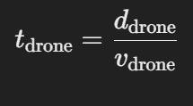
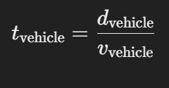
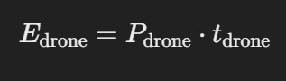
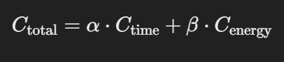

Week 1: Formulate time-energy joint cost function

    Outline: The goal of this week is to optimize the Vehicle Routing Problem (VRP) by minimizing a joint cost function. The cost function includes both time and energy consumption, which means that the impact of both needs to be considered simultaneously and their balance needs to be found.

        Step 1: Define the time cost function

            Time cost usually refers to the time it takes for a vehicle (autonomous cars and drones) to get from one point to another. It usually depends on distance, speed, traffic conditions, etc.
            
            (1)Drone: The flight time can be calculated by the relationship between the flight distance and the flight speed.
                

            
            Plus: Drone flight time may be affected by flight altitude, wind speed and other external environmental factors.

            (2)Autonomous Vehicle: Driving time is usually calculated by driving distance and vehicle speed, but the speed may vary due to the influence of urban traffic.

            Plus: For autonomous vehicles in cities, it may also be necessary to consider traffic models (for example, using SUMO for traffic simulation) to dynamically adjust the vehicle speed.

        Step 2: Define energy cost function

            (1)Drone: Energy consumption of drone is related to flight time as well as factors such as air resistance, load, and flight altitude.

            Among them, P is the power consumption of the drone, and T is the flight time.

            (2)Autonomous Vehicle: Energy consumption is related to speed, load, etc. The energy model may be:

        Step 3: Define combined cost function

        Combining time and energy costs into a comprehensive cost function allows both factors to be considered when optimizing the path. A weighting factor can be used to balance the importance of time and energy:

        α and β are weight coefficients used to balance the importance of time and energy. 

        Step 4: Creating MILP Model

        Through the above formula analysis, a joint time-energy optimization MILP model is established to determine whether the task should be performed by a drone or an autonomous vehicle to minimize the total cost. PuLP is used for modeling, and solve() is used to solve the MILP problem to obtain the optimal task allocation strategy. Finally, the model outputs the optimal path selection and total cost.

        Variables & Constraints:
                
        (1) Decision variables:

            x[i] → Whether the UAV performs task i (0 or 1)

            y[i] → Whether the vehicle performs task i (0 or 1)

        (2) Objective function:

            α and β represent the importance weights of time and energy respectively.
            Total_Time is obtained by summing the time required for task execution.
            Total_Energy is calculated by energy consumption.

        (3) Constraints:

            1. Tasks must be assigned: 
                
                Task must be performed by drones or vehicles, and cannot be handled unmanned.
            
            x[i] + y[i] = 1, ∀i ∈ Tasks

            2. Path selection constraints:

                The drone and vehicle paths for each task can only be selected 0 or 1 times.

            0 ≤ x[i] ≤ 1, 0 ≤ y[i] ≤ 1

            3. Optimization constraints:

                a. Time windows can be added (tasks must be completed within a specific time range).
            
                b. Vehicle capacity constraints (a single transport cannot be overloaded).

        Plus: matplotlib is used to plot the number of tasks vs total cost line chart and a bar graph of different weights and task allocations to help intuitively understand the performance of the optimization model.
                    