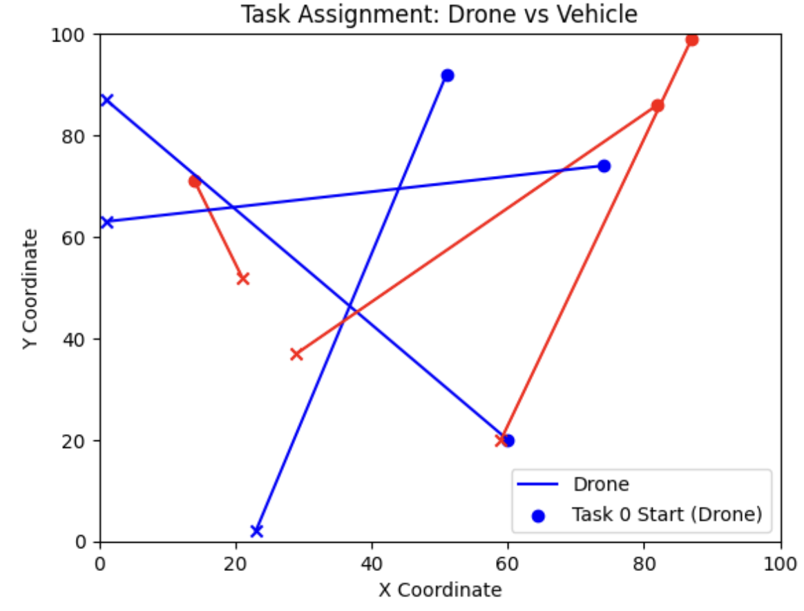

Week 2: Model UAV range constraints with wind effects

Outline:    Wind speed significantly impacts the maximum range of the UAV by altering its aerodynamic performance and energy consumption. The goal of this week is to necessitate the development of a dynamic model that accounts for variable wind conditions, including headwinds, tailwinds, and crosswinds, to accurately predict and optimize flight parameters such as speed, altitude, and power usage in real-time.

### Step 1: Choosing a suitable modeling method.

When modeling the impact of wind effects on the range of UAVs, there are two modeling methods to choose from: linear approximation model or nonlinear correction term. The former uses a simplified linear relationship to approximate the effect of wind speed on the range of UAVs, so that it can be directly used in MILP. Its advantages are that it uses a linear form, is suitable for MILP, is computationally efficient, and does not introduce nonlinear complexity. It is also suitable for small and medium-sized problems and is easy to handle by solvers (such as Gurobi). Its disadvantages are limited accuracy and cannot accurately simulate the complex effects of wind speed in different directions. It also ignores nonlinear factors such as turbulence or altitude changes. The latter uses a more accurate nonlinear formula, such as a correction based on the energy consumption model. The advantages are that it is more accurate and can better describe the impact of wind speed. It is also suitable for more complex optimization problems. If more sophisticated UAV scheduling analysis is needed in the future, this model is more flexible. The disadvantage is that it introduces nonlinear terms (quadratic terms, exponential terms), causing MILP to become nonlinear integer programming (MINLP), which is more complex to calculate and slower to solve. And more experimental data is needed to fit the parameters, otherwise the effect may be unstable. Because this project needs to ensure the solvability of MILP, a linear approximation model seems to be a better choice. The linear approximation model ensures that the MILP solver (e.g., Gurobi, CPLEX) runs efficiently while taking into account the effect of wind speed on the UAV’s range.

### Step 2: Determine basic variables and parameters.

#### Key variable definitions

- $R_i$：The maximum navigable distance that the drone can fly after taking off from node \( i \) (decision variable).
This variable represents the maximum distance that the drone can fly after taking off from node \( i \) taking into account the influence of wind speed and wind direction.

- $R_0$：Maximum range of the drone in windless conditions (constant).
This parameter indicates the maximum flight distance that the drone can achieve based on its energy reserves and performance in windless conditions.

- $V$：The cruising speed of the drone (constant).
This parameter represents the standard flight speed of the drone in windless conditions.

- $V_w$：Wind speed (constant or external data input).
This parameter indicates the wind speed in the current environment, which may be a constant or dynamically input based on external data.

- $\theta_i$：The angle between the wind direction and the drone's heading (decision variable).
This variable represents the angle between the wind direction and the drone's current flight direction, and is used to calculate the effect of wind speed on flight efficiency.

- $\alpha$：Wind speed influence coefficient (empirical parameter, usually ranging from 0.8 to 1.2).
This parameter is used to quantify the impact of wind speed on the flight efficiency of the drone, and its value is usually determined based on experimental data or experience.

### Step 3: Establish a linear formula for the effect of wind speed.

Wind speed $V_w$ and wind direction $\theta_i$ have a significant impact on the actual range $R_i$ of the drone. A linear approximation model is used to describe the impact of wind speed and wind direction on the range. The formula is as follows:

$$
R_i = R_0 \left(1 - \alpha \frac{V_w \cos \theta_i}{V}\right)
$$

Among them:

$R_i$: The maximum navigable distance of the drone after taking off from node $ i $ (decision variable).

$R_0$: The maximum range of the drone in a windless state (constant).

$ V $: The cruising speed of the drone (constant).

$ V_w $: Wind speed (constant or external data input).

$ \theta_i $: The angle between the wind direction and the heading of the drone (decision variable).

$ \alpha $: Wind speed influence coefficient (empirical parameter, usually ranging from 0.8 to 1.2).

#### Analysis of the impact of wind direction on range:
1. Tailwind ($ \cos \theta_i > 0 $):
The wind speed is the same as the heading of the drone, and the range $ R_i $ increases.
2. Headwind ($ \cos \theta_i < 0 $):
The wind speed is opposite to the heading of the drone, and the range $ R_i $ decreases.
3. Crosswind ($\cos \theta_i \approx 0 $):
The wind speed is perpendicular to the heading of the drone, and the impact on the range is small and can be ignored.

Note: This formula ensures that $R_i$ is still linear!

### Step 4: Convert to MILP compatible form

#### Discretization and linearization of wind direction

In mixed integer linear programming (MILP), since $ \cos \theta_i $ is not a linear variable, it needs to be linearized by discretization and the introduction of binary variables. The specific methods are as follows:

#### 1. Discretization of wind direction
Discretize the wind direction $ \theta_i $ into $ k $ directions (for example, 8 directions), and introduce a binary variable $ b_{ik} $ to represent the direction selection:

$$
\sum_{k} b_{ik} = 1, \quad b_{ik} \in \{0, 1\}
$$

Where:
- $ b_{ik} $: binary variable, indicating that the drone selects the $ k $ th direction at node $ i $.
- $ k $: total number of directions after discretization.

#### 2. Linearization $ \cos \theta_i $
Through discretization, $ \cos \theta_i $ can be approximated by a set of pre-computed constant values ​​$ C_k $:

$$
\cos \theta_i \approx \sum_{k} C_k b_{ik}
$$

Where:
- **$ C_k $**: pre-computed constant, representing the $ \cos $ value corresponding to the $ k $th direction.

#### 3. Replace the original formula
Substitute the linearized $ \cos \theta_i $ into the original formula to get the linearized range formula:

$$
R_i = R_0 \left(1 - \alpha \frac{V_w}{V} \sum_{k} C_k b_{ik}\right)
$$

#### 4. Preset $ C_k $ value
For example, when discretized into 8 directions, the value of $ C_k $ can be:
$$
C = [1.0, 0.707, 0, -0.707, -1.0, -0.707, 0, 0.707]
$$

The corresponding directions are: east, northeast, north, northwest, west, southwest, south, southeast.

#### 5. Notes
- This formula ensures the linearity of $R_i$ through discretization and linearization, and can be directly used in MILP models.
- The number of discretization directions $k$ can be adjusted according to the accuracy requirements. The more directions, the higher the model accuracy, but the computational complexity will also increase.

### Step 5: Add drone range constraint

When the drone flies from node $ i $ to node $ j $, it must ensure that the flight distance $ d_{ij} $ does not exceed the maximum navigable distance $ R_i $ of the drone. This constraint can be expressed as:

$$
d_{ij} \leq R_i
$$

Where:
- **$ d_{ij} $**: The flight distance of the drone from node $ i $ to node $ j $ (decision variable).
- **$ R_i $**: The maximum navigable distance of the drone after taking off from node $ i $ (decision variable), whose value is determined by the influence of wind speed and wind direction.

#### Physical meaning of constraint
This constraint ensures that the drone does not exceed its maximum range after considering the influence of wind speed and wind direction. Specifically:
1. If $ d_{ij} > R_i $, the UAV cannot complete the flight mission from node $ i $ to node $ j $.
2. This constraint, combined with the influence model of wind speed and wind direction, can dynamically adjust the maximum range of the UAV, thereby optimizing the flight path and task allocation.

#### Linear characteristics of the formula
Since $ R_i $ has been expressed as:

$$
R_i = R_0 \left(1 - \alpha \frac{V_w}{V} \sum_{k} C_k b_{ik}\right)
$$

Therefore, the constraint $ d_{ij} \leq R_i $ is still linear and can be directly used in the mixed integer linear programming (MILP) model.

#### Notes
- This constraint is one of the core constraints of the UAV path planning and task allocation problem.
- In practical applications, the flight distance $ d_{ij} $ can be calculated by the geographic coordinates of node $ i $ and node $ j $.
- Combined with the influence model of wind speed and wind direction, this constraint can effectively improve the robustness and feasibility of UAV mission planning.

### Step 6: Integration into MILP model

Finally, the following constraints need to be added to the mixed integer linear programming (MILP) model to consider the impact of wind speed and wind direction on the range of the UAV:

#### 1. Maximum range of the UAV affected by wind speed
The maximum navigable distance of the UAV $ R_i $ is affected by wind speed and wind direction, and its calculation formula is:

$$
R_i = R_0 \left(1 - \alpha \frac{V_w}{V} \sum_{k} C_k b_{ik}\right)
$$

#### 2. Discrete constraints for wind direction selection
To ensure that the UAV selects a unique wind direction, the following constraints need to be added:

$$
\sum_{k} b_{ik} = 1, \quad b_{ik} \in \{0, 1\}
$$

#### 3. Drone range limit
When the drone flies from node $ i $ to node $ j $, the flight distance $ d_{ij} $ must satisfy the following constraints:

$$
d_{ij} \leq R_i
$$

Where:
- **$ d_{ij} $**: The flight distance of the drone from node $ i $ to node $ j $ (decision variable).
- **$ R_i $**: The maximum navigable distance of the drone after taking off from node $ i $ (decision variable).

#### 4. Notes
- The above constraints are all linear constraints and can be directly used in the MILP model.
- The influence of wind speed and wind direction is linearized to ensure the linear characteristics of the model.
- The number of discretized directions $ k $ can be adjusted according to the accuracy requirements. The more directions, the higher the model accuracy, but the computational complexity will also increase.
- This model is suitable for UAV path planning and task allocation problems, and can effectively improve the robustness and feasibility of task planning.

### Key Advantages

1. **Fully linearized model**
This model is discretized and linearized to ensure that all constraints and objective functions are in linear form, and is fully applicable to mixed integer linear programming (MILP). The advantage of linear models is that solvers (such as Gurobi, CPLEX, etc.) can handle them efficiently, significantly reduce computational complexity, and ensure that the global optimal solution is obtained within a reasonable time.

2. **Adjustable wind speed effect**
The wind speed effect coefficient \( \alpha \) in the model can be adjusted according to actual environmental conditions (usually in the range of 0.8~1.2), so as to flexibly adapt to different wind speed intensities and drone performance. This adjustability enables the model to be widely used in a variety of scenarios, such as urban environments, mountainous areas or coastal areas.

3. **Support for multiple wind direction discretization**
The model supports discretization of wind direction into multiple directions (e.g., 8 or more directions), and accurately describes the effect of wind speed and wind direction on the range of the UAV by introducing binary variables \( b_{ik} \) and pre-calculated constants \( C_k \). The increase in discretization directions can improve the accuracy of the model while maintaining linear characteristics, which is suitable for high-precision mission planning needs.

4. **Dynamic adaptation to complex environments**
By combining wind speed, wind direction, and UAV performance parameters, the model can dynamically adjust the maximum range of the UAV to ensure the feasibility and robustness of the flight mission in complex environments. This dynamic adaptability makes the model more practical and reliable in practical applications.

5. **Easy to expand and integrate**
The model has a clear structure and is easy to expand and integrate into more complex UAV mission planning systems. For example, functions such as energy consumption, obstacle avoidance constraints, or multi-UAV collaborative task allocation can be further added to meet diverse application needs.

### Roadmap:

The roadmap for each task is drawn using matplotlib. Each line segment represents the execution route of the task, from the starting point to the end point. If the task is assigned to a drone, the route is represented in blue; if the task is assigned to a vehicle, the route is represented in red. The starting point of the task is represented by a dot, and the end point is represented by a cross. The generated roadmap shows the execution path of the task and clarifies the executor of each task.
The following is a task allocation roadmap generated based on the model:

The blue route represents the task performed by the drone, the blue dot represents the starting point of the task, and the blue cross represents the end point of the task.

The red route represents the task performed by the vehicle, the red dot represents the starting point of the task, and the red cross represents the end point of the task.

Each route represents the execution path of the task, connecting the starting point and the end point, showing the optimized task allocation.

By optimizing the task allocation, we can effectively reduce the overall time and energy consumption. When there are a large number of tasks, the optimization model can significantly improve the efficiency of task execution. The roadmap generated by the visualization tool allows us to intuitively see the task allocation and evaluate the execution path of each task.

In practical applications, if more complex factors (such as task priority, time window, etc.) are considered, the model can be further improved and expanded. In addition, the introduction of wind effect makes the execution of drone tasks more complicated. Considering the influence of wind speed and wind direction helps to simulate the situation in the actual environment more realistically.

The final generated roadmap is as follows:

