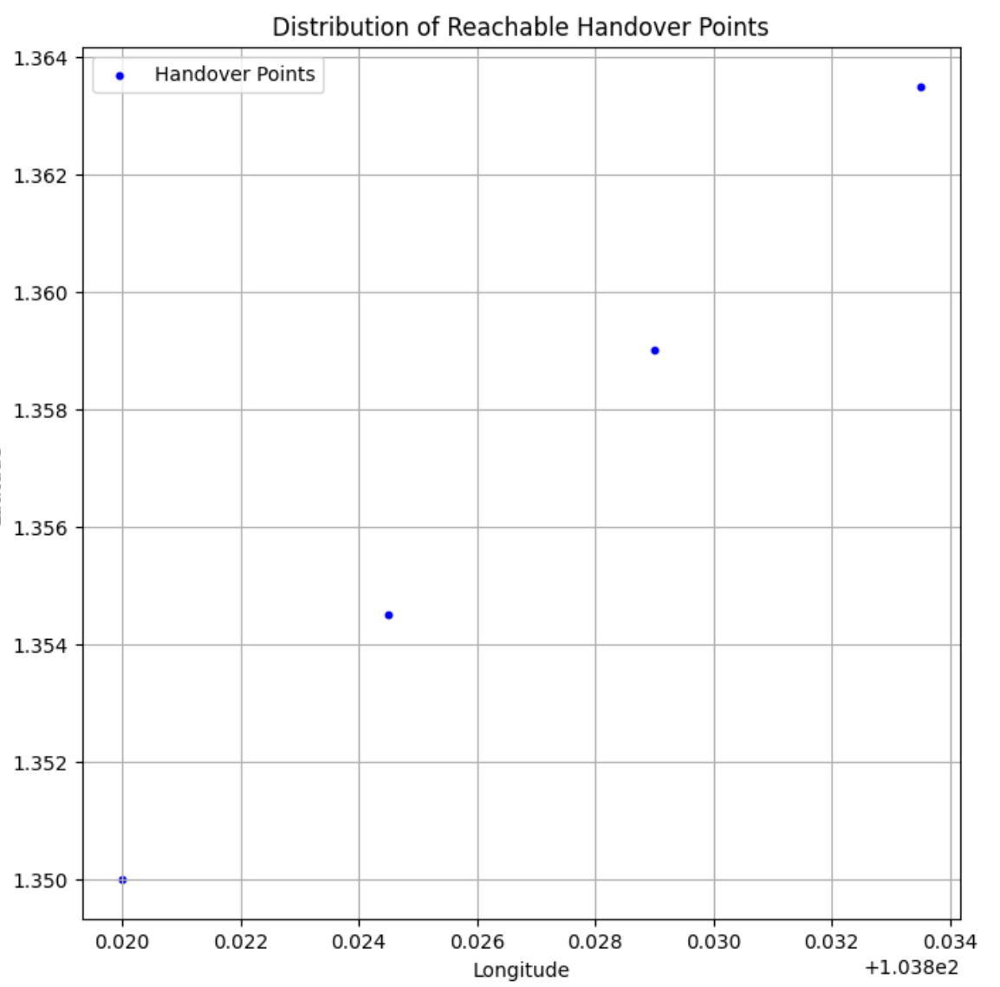

# Week 3: Develop truck-drone handover time matrix

## Outline： The core of the truck-drone handover time matrix is ​​to calculate the handover time between each pair (truck, drone, handover point), which involves multiple factors, including the time when the truck arrives at the handover point, the drone's takeoff time, the duration of the drone-truck handover operation, and the impact of environmental factors (such as weather, traffic, etc.) on the handover process. This matrix is ​​used to set the corresponding constraints or objective functions in the MILP model to ensure that the actual timeliness of the handover operation can be taken into account during path planning and task scheduling. This calculation must not only consider the timing of the handover, but also the time delays that may be encountered by trucks and drones during actual execution, to ensure that the optimization solution can accurately reflect the actual situation and effectively improve the efficiency of the overall system.

### Step 1: Handover Locations

The solution combines "dynamic handover point + flexible site selection". This solution is simple and intuitive, does not require complex optimization, ensures that trucks and drones can be handed over, reduces waiting time, and improves the collaborative efficiency of drones and trucks.

The following represents randomly generated intersection points:

| latitude | longitude | timestamp |
|----------|----------|----------|
| 1.35 | 103.82 | 8:00:00 |
| 1.3512 | 103.8215 | 8:02:30 |
| 1.352 | 103.823 | 8:05:00 |
| 1.3545 | 103.8245 | 8:08:00 |
| 1.356 | 103.826 | 8:12:00 |
| 1.3575 | 103.8275 | 8:40:00 |
| 1.359 | 103.829 | 9:05:00 |
| 1.3605 | 103.8305 | 9:36:00 |
| 1.362 | 103.832 | 10:15:00 |
| 1.3635 | 103.8335 | 10:40:00 |

Save this table in a .csv file for direct reference.

1. The first task is to select candidate handover points from the truck’s route, ensuring that the interval between adjacent handover points is at least 500 meters to avoid frequent stops. At the same time, the entire route should be covered as much as possible to provide enough handover point options for the drone.

2. The second task is to select the handover points that the drone can reach. First, determine the starting point of the drone (the default is the truck starting point) and the maximum range (such as 5,000 meters). Then, calculate the straight-line distance from the drone to each handover point and eliminate those handover points that exceed the maximum range to ensure that the drone can successfully reach the target handover location.

3. Finally, the filtered available intersection point data is saved and visualized. First, these intersection points are stored in CSV files for subsequent processing and analysis. Then, Matplotlib is used to draw a location map of the intersection points to show their distribution on the map for optimization and verification.

Number of handover points accessible by drone: 4
$[(1.35, 103.82), (1.3545, 103.8245), (1.359, 103.829), (1.3635, 103.8335)]$

The generated chart is as follows:

### Step 2: Calculate the arrival time of the truck to the handover points

The task is to calculate the arrival time of the truck at each junction. First, set the truck's speed (assuming it is 30 km/h, which can be adjusted according to actual needs). Then, use geopy to calculate the straight-line distance between the truck's starting point and each junction. Finally, based on the truck's speed and the calculated distance, the time required to reach each junction is obtained. This process can provide the necessary time information for subsequent path optimization and task scheduling.

Here is the result:

Handover point (1.35, 103.82) Arrival time：08:00:00
Handover point (1.3545, 103.8245) Arrival time：08:01:24
Handover point (1.359, 103.829) Arrival time：08:02:49
Handover point (1.3635, 103.8335) Arrival time：08:04:14

### Step 3: Calculate the arrival time of the drone to the handover points

Calculate the flight time from the drone to the handover point, taking into account the effect of wind speed. First, set the drone's flight speed (assuming 60 km/h, which can be adjusted based on specific circumstances). Then, take into account the effect of wind speed and correct the drone's flight speed, speeding up when the wind is downwind and slowing down when the wind is against you. Finally, calculate the drone's flight time based on the corrected flight speed and the flight distance from the starting point to the handover point. This calculation will help ensure that the drone can complete the mission on time and be properly dispatched.

Assume that the wind speed affects the calculation as follows:

1. With the wind: the drone speed increases with the wind speed.

2. Against the wind: the drone speed decreases with the wind speed.

3. Without wind: the speed remains the same.

Downwind: $V_{actual} = V_{drone} + V_{wind}$

Against wind: $V_{actual} = V_{drone} - V_{wind}$

#### Explanation:
Wind speed correction: If it is a tailwind, the actual flight speed is drone_speed + wind_speed, if it is a headwind, the actual flight speed is drone_speed - wind_speed. It can be adjusted according to the actual wind speed.

Flight time calculation: Calculate the flight time based on the flight distance and the corrected flight speed. The unit of flight time is seconds, which can be converted into more convenient units (such as minutes) as needed.

Arrival time calculation: Add the flight time to the departure time of the truck through datetime.timedelta to get the arrival time of the drone.

#### Here is the result:

Handover point (1.35, 103.82): 
Truck Arrival Time: 08:00:00 
Drone arrival time: 08:00:00 
Handover time: 08:00:00 
Waiting time: 0.0 s 

Handover point (1.3545, 103.8245)： 
Truck Arrival Time: 08:01:24 
Drone arrival time: 08:00:36 
Handover time: 08:01:24 
Waiting time: 48.0 s 

Handover point (1.359, 103.829)： 
Truck Arrival Time: 08:02:49 
Drone arrival time: 08:01:12 
Handover time: 08:02:49 
Waiting time: 97.0s 

Handover point (1.3635, 103.8335)： 
Truck Arrival Time: 08:04:14 
Drone arrival time: 08:01:48 
Handover time: 08:04:14 
Waiting time: 146.0 s 

### Step 4: Calculate handover wait time

The task is to calculate the handover time and waiting time for each handover point. The handover time is determined by comparing the arrival time of the truck and the drone and taking the larger value. The waiting time is calculated based on the arrival time difference. If the truck arrives early, the truck needs to wait for the drone; if the drone arrives early, the drone needs to wait for the truck. Through these calculations, you can choose to optimize the dispatch by synchronous arrival, pre-docking or dynamic adjustment strategies according to the length of the waiting time, thereby improving overall efficiency.

#### Optimization strategies:
1. Synchronized Arrival: The dispatching strategies of trucks or drones can be optimized to make the arrival time of the two as close as possible.If the truck arrives early, its departure time can be delayed or the flight path of the drone can be adjusted to make both arrive at the same time.

2. Truck Wait Strategy: If the truck arrives early, the truck can be made to wait for a short time until the drone arrives. This strategy is simple, but it may lead to reduced truck efficiency, especially between multiple handover points.

3. Dynamic Handover Adjustment: In real-time applications, when the drone or truck is delayed, the handover point can be replanned or the route can be adjusted to ensure a smooth handover in the end.
This strategy involves complex dynamic scheduling, which can adjust the paths of trucks and drones based on real-time data.

### Step 5: Build a handover time matrix

To facilitate the input of the MILP solver, we can store the handover time as a DataFrame, where each row represents the handover time of a pair of trucks and drones at a certain handover point. First, we create an empty DataFrame, assuming that the numbers of the trucks and drones are predetermined. Then, based on the calculation results of each handover point, the corresponding handover time, truck number, drone number, handover point location and other information are filled into the DataFrame. Finally, we save the generated results as a structured table for use by the MILP solver, so that the handover time and scheduling constraints can be handled efficiently.

|   | Truck | UAVs | Handover_Point | Time |
|---|-------|------|----------------|------|
| 0 |  T1  |  D1   |       P1       |28800.0|
| 1 |  T1  |  D1   |       P2       |28884.0|
| 2 |  T1  |  D1   |       P3       |28969.0|
| 3 |  T1  |  D1   |       P4       |29054.0|
| 4 |  T1  |  D2   |       P5       |28800.0|
