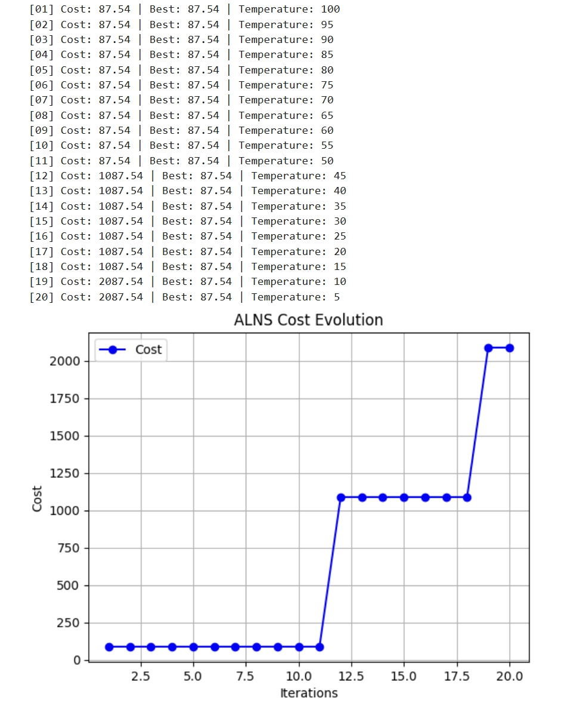

# Week 4: Implement adaptive large neighborhood search (ALNS)

## Outline: Currently, the project has entered the second phase, focusing on algorithm design and optimization engine development. We will continue to improve the hybrid ALNS-GA solver, taking into account factors such as truck and drone running time, energy consumption, waiting time at the task handover point, and various constraints such as drone range limitations and wind speed. By creating an adaptive large neighborhood search (ALNS) framework and genetic algorithm, the ultimate goal of the project is to provide an efficient and flexible optimization solution for last-mile delivery.

### Step 1: Preparing the basic structure
Required Classes and Components:

(1) Solution Class: This class represents the current solution. It contains the specific arrangement of truck routes and drone dispatch, and calculates and stores the total cost associated with the solution. With this class, we can efficiently manage routes, task assignments and their costs, and make necessary modifications and evaluations during the optimization process.<br>

(2) Operator Class: This class is used to define destruction and repair operators as a means of changing the solution. The destruction operator (Destroy) is responsible for removing some tasks or paths from the current solution, while the repair operator (Repair) is responsible for reinserting tasks to optimize the solution. These two functions can be implemented through function pointers or direct classification, so that different destruction and repair methods can be flexibly selected and called, thereby enhancing the diversity and scalability of the algorithm.<br>

(3) ALNS Class: As the main framework, the ALNS class is responsible for controlling the entire adaptive large neighborhood search process. It contains the iterative process, manages the selection of destruction and repair operators, and implements an adaptive selection strategy to adjust the selection probability of operators according to historical performance during the iteration process. In addition, the ALNS class is responsible for enforcing the acceptance criterion to ensure that new solutions are reasonably accepted during the solution optimization process to balance the risk of exploring the global optimal solution and avoiding the local optimal solution.<br>

### Step 2: Implementing the initial solution

To construct the initial solution, we can use a greedy algorithm. For each customer, we first calculate the cost of serving with a truck or a drone. If the drone can reach the customer and the cost of serving the customer is lower than using a truck, then the customer is assigned to the drone. For customers that cannot be served by the drone, we insert them into the truck's path and use the nearest neighbor principle, that is, select the customer closest to the end of the current path and construct the truck path in turn. This method can quickly construct a preliminary solution and provide a starting point for the subsequent optimization process.<br>

```
def construct_initial_solution(problem):
    solution = Solution()
    for customer in problem.customers:
        if drone_can_reach(customer):
            solution.assign_to_drone(customer)
        else:
            solution.insert_into_truck_route(customer)
    return solution
```

### Step 3: Defining the Destroy Operator

| Operator Name            | Strategy                              |
|-------------------|----------------------------------|
| Random Removal    | Randomly remove a portion of customers               |
| Worst Removal     | Remove the customer with the highest current contribution cost        |
| Related Removal   | Remove a group of customers with similar distance/time       |
<br>

The following is some sample code related to the destroy operator:
```
def random_destroy(solution, destroy_fraction=0.3):
    num_remove = int(len(solution.assignments) * destroy_fraction)
    new_assignments = solution.assignments.copy()
    to_remove = random.sample(range(len(new_assignments)), num_remove)
    for idx in sorted(to_remove, reverse=True):
        del new_assignments[idx]
    return Solution(new_assignments)
```

### Step 4: Defining the Repair Operator

| Operator Name     | Strategy                         |
|-------------------|----------------------------------|
| Greedy Insertion  | Insert the customer with minimum incremental cost each time |
| Regret Insertion  | Insert the customer with maximum "regret value" (e.g., largest gap between insertion options) |

<br>
Here are the sample code:
<br>

```
def random_repair(partial_solution, all_task_ids, handover_points):
    assigned = {a[0] for a in partial_solution.assignments}
    unassigned = [t for t in all_task_ids if t not in assigned]
    new_assignments = partial_solution.assignments.copy()

    for t in unassigned:
        mode = random.choice(['drone', 'vehicle'])
        h = random.choice(handover_points) if mode == 'drone' else None
        new_assignments.append((t, mode, h))
    return Solution(new_assignments)
```
```
def greedy_repair_drone_first(partial_solution, all_task_ids, handover_points):
    assigned = {a[0] for a in partial_solution.assignments}
    unassigned = [t for t in all_task_ids if t not in assigned]
    new_assignments = partial_solution.assignments.copy()

    for t in unassigned:
        if random.random() < 0.7:
            h = random.choice(handover_points)
            new_assignments.append((t, 'drone', h))
        else:
            new_assignments.append((t, 'vehicle', None))
    return Solution(new_assignments)
```

### Step 5: Adaptive operator selection mechanism

Weight Adaptation Strategy:<br>

Initially, all (destruction + repair) operator pairs are assigned equal weights. Each iteration, weights are updated based on performance scoring using exponential smoothing:

1. Large reward if the new solution is the best found so far

2. Small reward if the solution is accepted (but not optimal)

3. No reward otherwise

The scoring dynamically prioritizes operators that consistently generate high-quality solutions.

```
# Each operator has a score & weight
scores = {op_name: 0 for op_name in all_operators}
weights = {op_name: 1.0 for op_name in all_operators}

# Roulette Selection
def roulette_selection(weights):
    total = sum(weights.values())
    r = random.uniform(0, total)
    acc = 0
    for op, w in weights.items():
        acc += w
        if acc >= r:
            return op

```

### Step 6: Main Loop (ALNS Process)

Iteratively destroy and repair solutions using adaptive operator weights, evaluate new solutions with acceptance criteria (e.g., simulated annealing), update operator weights based on performance scores, and retain the best solution found until termination conditions (e.g., runtime or iteration limits) are met.

```
def run_alns(problem, max_iter):
    current = construct_initial_solution(problem)
    best = current.copy()

    for it in range(max_iter):
        destroy_op = select_destroy_operator()
        repair_op = select_repair_operator()

        removed = destroy_op(current, degree)
        candidate = repair_op(current, removed)

        if accept(candidate, current):  # Simulated annealing strategy
            current = candidate
        if candidate.cost < best.cost:
            best = candidate
            update_operator_score(destroy_op, repair_op, high_score=True)
        else:
            update_operator_score(destroy_op, repair_op, high_score=False)
    
    return best

```

### Step 7: Add simulated annealing as acceptance criterion

```
def accept(new, old, temperature):
    if new.cost < old.cost:
        return True
    else:
        delta = new.cost - old.cost
        return random.random() < math.exp(-delta / temperature)

```

### Step 8: Combining all the above functions into the ALNS framework yields a minimal ALNS implementation

This example framework consists of: (1) 20 virtual task points (T0-T19) with simulated distance/time/energy matrices, (2) a solution representation structure, (3) 2 destruction operators (random/worst removal) + 2 repair operators (greedy/regretful insertion), and (4) an ALNS main loop that performs 20 adaptive iterations with dynamic operator weights, acceptance criteria, and solution tracking. The system is initialized with equal operator weights and then iteratively destroys/repairs solutions while updating weights based on performance (new best solution gets a large reward, accepted solutions get a small reward).<br>

The final result of this code is shown in the figure below:

