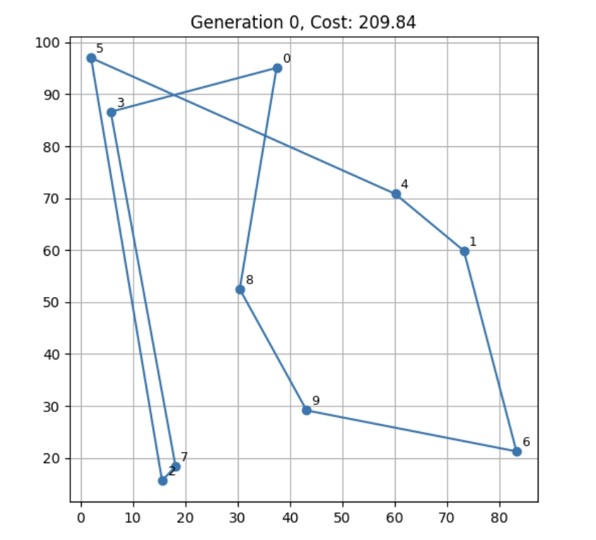
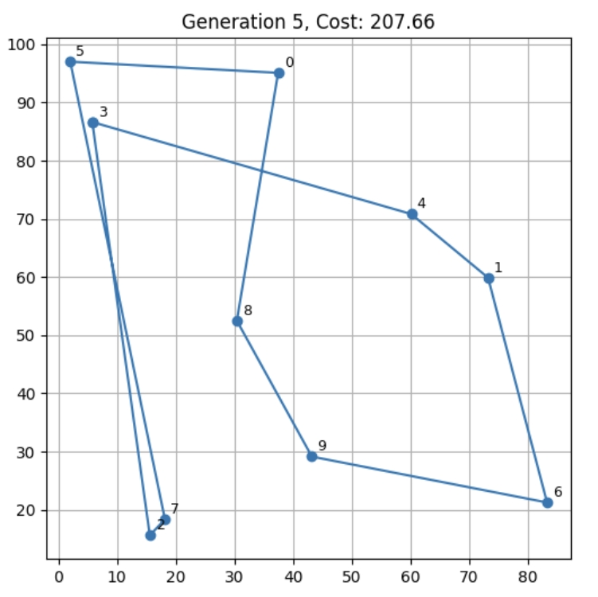
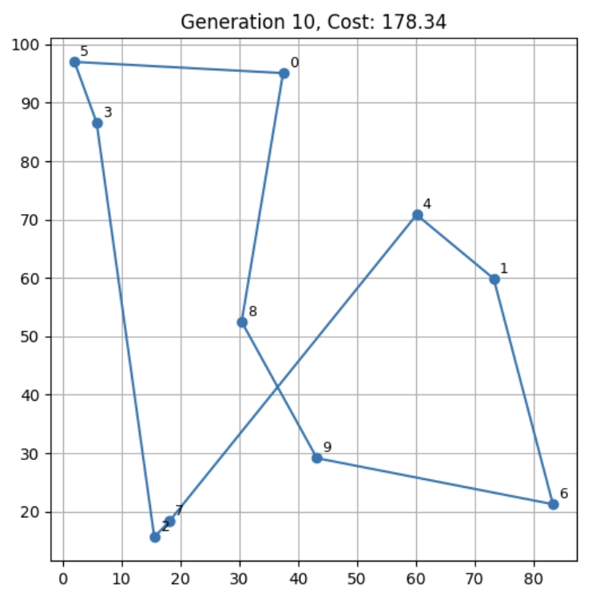
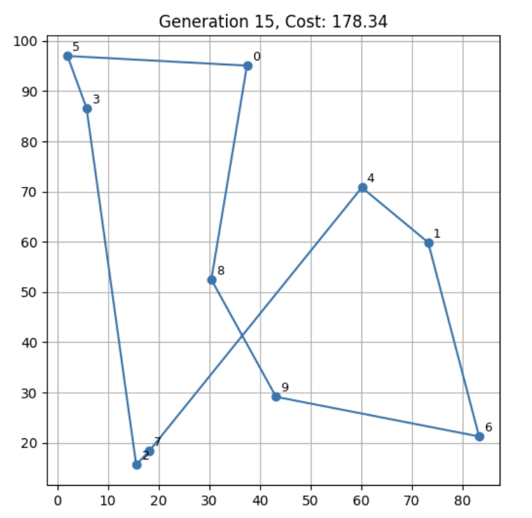
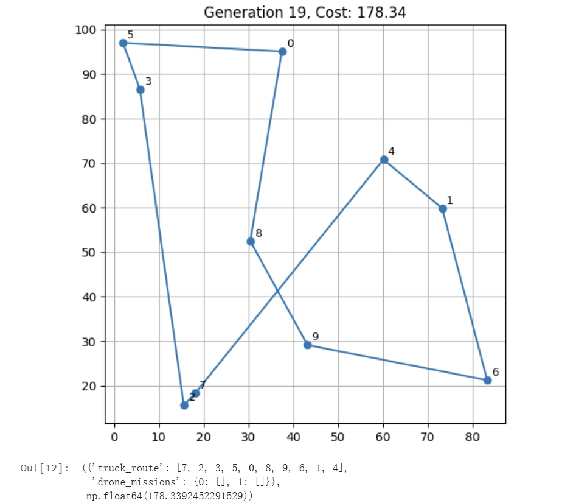

# Week 5: Creating a genetic algorithm using domain-specific operators

## Outline
As a meta-heuristic optimization method that simulates the biological evolution process, genetic algorithms have shown significant advantages in the field of combinatorial optimization by realizing intelligent search of solution space through operations such as selection, crossover and mutation. However, when faced with the complex optimization problem of truck-UAV collaborative path planning with multimodal constraints, the standard operators of traditional genetic algorithms have significant limitations: on the one hand, the characteristics of practical problems such as UAV endurance constraints and vehicle capacity restrictions require special chromosome encoding methods; on the other hand, the spatiotemporal coordination requirements of trucks and UAVs make it difficult for conventional crossover and mutation operations to maintain the effectiveness of the solution. To this end, this study proposes a domain-customized genetic algorithm for heterogeneous fleet collaborative delivery. Its core innovations are: 1. designing a hierarchical chromosome structure to simultaneously characterize truck paths and UAV task allocation; 2. developing an energy-aware collaborative crossover operator to ensure that UAV tasks do not violate battery constraints; 3. introducing a dynamic handover point optimization mutation strategy to improve the spatiotemporal coordination of the solution. Through this domain-specific genetic operation design, the algorithm can explore the solution space more efficiently, achieve multi-objective optimization of transportation cost, energy consumption and time efficiency, and provide a new optimization paradigm for last-mile logistics.

### Step 1: Overview of Genetic Algorithm
Genetic Algorithm (GA) is a type of optimization method that simulates natural selection and genetic processes. It gradually improves the quality of solutions by imitating the process of biological evolution in nature. GA is a heuristic search algorithm that can effectively find the global optimal or approximate optimal solution in a large-scale solution space. It is particularly suitable for complex optimization problems that cannot be solved by traditional algorithms.

#### Basic steps of genetic algorithm:
1. Initialize the population: Randomly generate a certain number of solutions (individuals) from the solution space to form the initial population.

2. Evaluate fitness: Evaluate each individual according to the predetermined objective function (or fitness function).

3. Selection: Select individuals for reproduction according to fitness. Roulette selection or tournament selection is usually used.

4. Crossover: According to a certain crossover probability (crossover rate), randomly select parents and perform crossover operations to generate new individuals.

5. Mutation: According to the mutation probability (mutation rate), some individuals are mutated to simulate gene mutation.

6. Elite retention: The best individuals in the population are directly retained to ensure that the best solution is not lost.

7. Repeat: Repeat the above steps until the stopping condition is met (such as reaching the maximum number of generations, convergence, etc.).

#### Application of genetic algorithms in path optimization problems:
In the truck-drone collaborative path optimization problem, individuals are usually represented as a path or task allocation scheme. For example, the truck path is represented as a series of customer visit sequences, and the drone tasks are represented as the tasks and handover points that each drone needs to complete. The fitness function evaluates the quality of each solution based on indicators such as total path length, time cost, and energy consumption.

The crossover operation usually involves exchanging parts of the paths of two parents to generate new solutions. The mutation operation is to fine-tune the path or task allocation to avoid falling into the local optimal solution.

### Step 2: Domain-specific genetic algorithm design

In order to effectively solve the truck-drone collaborative path optimization problem, we need to design genetic operators specific to the problem. The domain-specific operators here refer to special crossover, mutation, and other operations for the truck-drone problem, rather than directly using general genetic algorithm operations.

#### Initialize the population:
To ensure the quality of the initial solution of the population, we adopted two initialization strategies:

1. Random initialization: Randomly generate the path of the truck and randomly assign some tasks to the drone. This method is simple but can ensure the diversity of solutions.

2. Heuristic initialization: According to the order of customers' distance from the warehouse, customers who are closer to the warehouse are assigned to the drone first, and the battery life of the drone is ensured.

```
# Random initialization
def initialize_population():
    population = []
    for _ in range(pop_size):
        chrom = {
            'truck_route': np.random.permutation(num_customers).tolist(),
            'drone_missions': {i: [] for i in range(num_drones)}
        }
        population.append(chrom)
    return population
```

#### Crossover Operators:

In the truck-drone collaborative path optimization problem, we design specific crossover operations:

1. Truck path crossover: swap partial segments of the parent truck path.

2. Drone task crossover: swap the parent drone task assignments to ensure reasonable task assignment.

```
# Single point crossover
def crossover(parent1, parent2):
    if random.random() > crossover_rate:
        return deepcopy(parent1)
    cut = random.randint(1, num_customers - 2)
    child = deepcopy(parent1)
    child['truck_route'] = parent1['truck_route'][:cut] + [gene for gene in parent2['truck_route'] if gene not in parent1['truck_route'][:cut]]
    return child

```

#### Mutation Operators:
Mutation operators further explore the solution space by randomly changing the truck path or the drone task assignment. Mutations include:

1. Path swap mutation: randomly select two customers on the truck path to swap.

2. Drone task mutation: randomly change the assignment of a task, transferring the task from the truck to the drone or vice versa.

```
# Mutation operation (swap two positions)
def mutate(individual):
    if random.random() > mutation_rate:
        return individual
    i, j = random.sample(range(num_customers), 2)
    individual['truck_route'][i], individual['truck_route'][j] = individual['truck_route'][j], individual['truck_route'][i]
    return individual
```

#### Fitness evaluation:
The fitness function calculates the total time and energy cost of the path. For truck paths, we calculate the time cost of the truck driving; for drone missions, we calculate the time and energy consumption of the drone performing the mission.

```
def evaluate(individual):
    total_time = 0
    total_energy = 0

    # Truck Routes
    truck_route = individual['truck_route']
    for i in range(len(truck_route) - 1):
        total_time += distance_matrix[truck_route[i], truck_route[i + 1]] * truck_params['time_weight']
    total_time += distance_matrix[truck_route[-1], truck_route[0]] * truck_params['time_weight']

    # Drone Missions
    for handover, missions in individual['drone_missions'].items():
        for mission in missions:
            total_time += distance_matrix[handover, mission] * drone_params['time_weight']
            total_energy += distance_matrix[handover, mission] * drone_params['energy_weight']

            # Return the handover point (if necessary)
            total_time += distance_matrix[mission, handover] * drone_params['time_weight']
            total_energy += distance_matrix[mission, handover] * drone_params['energy_weight']

    # Cost function calculation: including time and energy
    return total_time + total_energy

```

### Step 3: Algorithm Implementation
The following is the main code framework of this implementation, covering operations such as population initialization, selection, crossover, and mutation.
```
# Genetic algorithm main process
def genetic_algorithm():
    population = initialize_population()  # Initialize the population
    best_costs = []

    for generation in range(num_generations):
        fitnesses = [evaluate(ind) for ind in population]  # Evaluate fitness
        new_population = []

        # Elite Retention
        elite_indices = np.argsort(fitnesses)[:elitism]
        for i in elite_indices:
            new_population.append(population[i])

        # Generate new individuals
        while len(new_population) < pop_size:
            parent1 = tournament_selection(population, fitnesses)  # Tournament Selection
            parent2 = tournament_selection(population, fitnesses)
            child = crossover(parent1, parent2)  # Crossover Operation
            child = mutate(child)  # Mutation Operation
            new_population.append(child)

        population = new_population  # Update population
        best_idx = np.argmin([evaluate(ind) for ind in population])  # Get the best individual
        best_cost = evaluate(population[best_idx])
        best_costs.append(best_cost)

        # Visualize the current optimal path
        if generation % 5 == 0 or generation == num_generations - 1:
            best_route = population[best_idx]
            plot_route(best_route, generation, best_cost)  # Draw the path

    return population[best_idx], best_costs
```

### Step 4: Results and Analysis

#### The results of the genetic algorithm are as follows:






- Best solution: The optimal path that the genetic algorithm finally converges to is [7, 2, 5, 3, 0, 8, 9, 6, 1, 4].

- Cost function value: The total cost of the optimal solution is about 364.81.

The chart shows the convergence process of the genetic algorithm in each generation. As the number of generations increases, the fitness gradually increases and finally converges to a stable solution.

#### Visualization path:
- During the algorithm optimization process, the path is gradually improved through crossover and mutation operations.

- The current optimal path is output every 5 generations, and the gradual improvement of the path is displayed.